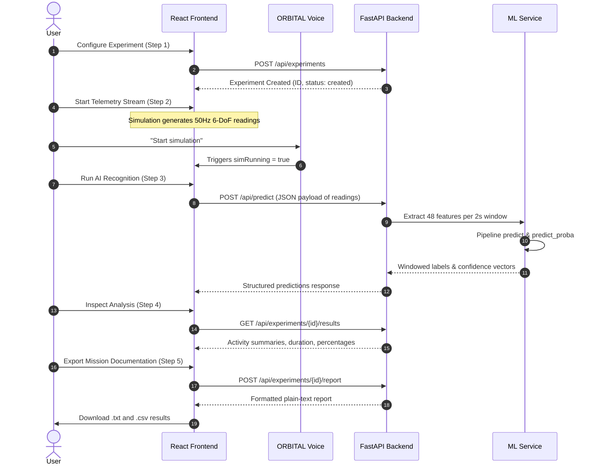

# System Architecture — ORBITAL (SIH26174)

This document provides a comprehensive breakdown of the architectural decisions, component layers, data flows, and design principles underpinning **ORBITAL — Human Activity Intelligence**.

---

## 1. High-Level System Architecture

ORBITAL follows a clean client-server architecture with decoupled presentation, backend services, and machine learning components:

```
[ Web Browser Client ]
  │
  ├── React 18 SPA (Vite + TypeScript)
  │    ├── Zustand Global State (Store)
  │    ├── Web Speech API (Voice Assistant Engine)
  │    ├── Browser Simulation Engine (50 Hz IMU generator)
  │    └── Recharts Telemetry Rendering
  │
  └── REST HTTP / Multipart Transport
       │
[ FastAPI Application Server ]
  │
  ├── API Routers (experiments, predict, upload, reports)
  ├── Pydantic V2 Schema Validation
  ├── In-Memory Experiment Session Cache
  └── Service Layer
       ├── ML Inference Service
       ├── Feature Extraction Engine (48 statistical features)
       └── Report Synthesis Engine
            │
[ Scikit-Learn Pipeline Artifact ]
  └── StandardScaler + RandomForestClassifier (Joblib serialised)
```

---

## 2. Component Layer Responsibilities

### 2.1 Presentation Layer (Frontend)
- **Design Language**: Aerospace research grade light mode (#F7F9FC canvas, #FFFFFF cards, #3978E8 primary blue, #718096 muted text).
- **State Management**: Zustand store maintains shared experiment configuration, sensor reading buffers, inference predictions, and step transitions without prop drilling.
- **Hands-free Operation**: Browser-side Web Speech Recognition and Speech Synthesis APIs integrated into a floating voice widget with full fallback text input.

### 2.2 Backend Service Layer (FastAPI)
- **Model Lifecycle**: Singleton `ModelLoader` class initialized at application startup via FastAPI lifespan context manager to eliminate per-request cold starts.
- **Data Validation**: Strict Pydantic schemas enforce type safety across 6-axis IMU inputs (`acc_x`, `acc_y`, `acc_z`, `gyro_x`, `gyro_y`, `gyro_z`).
- **Data Ingestion**: Multi-modal ingestion supporting real-time streaming batches as well as tabular CSV upload with missing-value sanitization and row limiting.

### 2.3 Machine Learning Pipeline Layer
- **Windowing Strategy**: Sliding temporal windows of 100 samples (2.0s duration at 50 Hz) with 50-sample step (50% overlap).
- **Feature Space**: 48 statistical features (8 metrics across 6 sensor channels: mean, standard deviation, min, max, range, RMS, skewness, and kurtosis).
- **Classifier**: 100-tree Scikit-learn Random Forest ensemble providing fast, deterministic, and probabilistic inference.

---

## 3. Data Flow Diagram



---

## 4. Security & Safety Principles

1. **Local-First Audio Processing**: Audio captured by the voice assistant is processed locally by browser APIs; zero raw audio buffers are transmitted to external servers.
2. **Safe Command Whitelist**: Voice commands are mapped to an explicit whitelist of UI state transitions and simulation triggers; arbitrary system execution is strictly prohibited.
3. **Ground Truth Transparency**: All synthetic demonstration results are prominently watermarked in UI cards and generated documentation to prevent academic misrepresentation.
